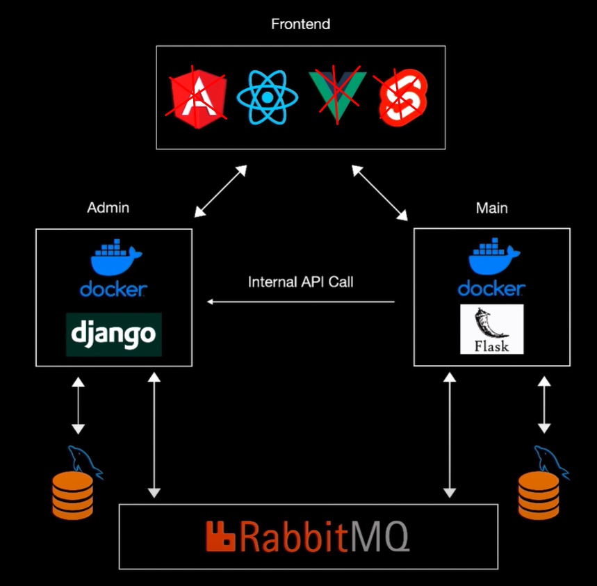

# Python Microservice web app development (django, reactjs)

Using python microservices allows you to break up your apps into smaller parts that communicate with each other.
This can make it simpler to scale the application based on the traffic. 

What are microservices?
Microservices are smaller independent services they have their own database they can communicate each other using an **Event Bus**.

##### Benefits:
* Scaled microservice for time
* Separation of concern only focus service

##### Project development cycle

##### Admin Django Python packages:
1. **Django(5.0.4)**: Django is a high-level Python web framework that encourages rapid development and clean, pragmatic design.
2. **djangorestframework(3.15.1)**: Django REST framework is a powerful and flexible tookit for building Web APIs. Serialization that supports both ORM and non-ORM data sources. regular function-based views more powerful.
3. **mysqlclient(2.2.4)**: MySQLdb is an interface to the popular MySQL database server that provides the python database API.If you want to write applications which are portable across databases, use MySQLdb, and avoid using this module directly.
4. **django-mysql(4.12.0)**: Django-MySQL extends Django's built-in MySQL support their specific features not available on other databases.
5. **django-cors-headers(4.3.1)**: A django App that adds Cross-Origin Resource Sharing(CORS) headers to responses. This allows in-browser requests to your Django application from other origins. Adding CORS headers allows your resources to be accessed on other domains.
6. **pika(1.3.2)**: Pika is a pure-python implementation of the AMZP 0-9-1 protocol including RabbitMQ's extensions. Since threads aren't appropriate to every situation, it doesn't require threads. Pika core takes care not to forbid them, either. An instance of Pika's built-in connection adapters isn't thread-safe.
7. **pillow(10.3.0)**: The python Imaging Library adds image processing capabilities to your python interpreter. This library provides extensive file format support, an efficient support, an efficient internal representation, and fairly powerful image processing capabilities.

##### Main Flask Python Packages:
1. **Flask(3.0.3)**:

### Running Steps:

| Title                | Command                                                        | Description                                                                                                                                                                                    |
|----------------------|----------------------------------------------------------------|------------------------------------------------------------------------------------------------------------------------------------------------------------------------------------------------|
| docker compose       | docker-compose up                                              | it's build the backend services task and build image run container.                                                                                                                            |
| docker image build   | docker -t microservice_ecommerce_backend:0.0.1 .               | it will build a new image with assigned name and version                                                                                                                                       |
| docker container generate | docker run -p 8000:8000 -d microservice_ecommerce_backend:0.0.1 | It's create and run the docker container                                                                                                                                                       |
| docker bash run      | docker run -it microservice_ecommerce_backend:0.0.1 bash       | This command runs a new container from the ubuntu:latest image, starts it in interactive mode (-i), and attaches a pseudo-terminal (-t) so you can interact with the container's shell (bash). |
| docker stop          | docker stop CONTAINER_ID                                       | The ID of the container you want to stop.                                                                                                                                                      |
| docker start         | docker start CONTAINER_ID                                      | Replace with the actual container ID                                                                                                                                                           |
| docker list          | docker ps -a                                                   | This command lists all containers, including running and stopped ones.                                                                                                                         |
| docker execution     | docker exec -it CONTAINER_ID bash                              | Runs a command inside a running container.                                                                                                                                                     |
| docker shell access  | docker-compose exec backend sh                                 | Docker service shell execution                                                                                                                                                                 |

